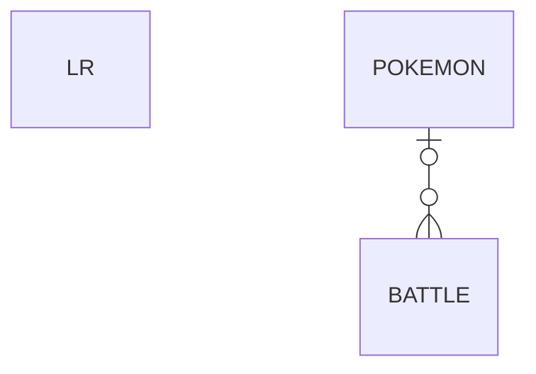

# Pokemon Challenge

## Para ejecutar codigo

```bash
# Buildeamos el front

cd pokemon-challenge-frontend/
npm install
npm run build

# Buildeamos el back

cd ../pokemon-challenge-backend/
npm install
npm run build
npx typeorm-ts-node-commonjs migration:run -d db/data-source.ts
npm run start:prod
```

- Ahora en el `http://localhost:3000` se deberia poder ver el frontend de la aplicacion.
- En `http://localhost:3000/api` esta la documentacion de los endpoints hecha con swagger.

## Sobre la base de datos

